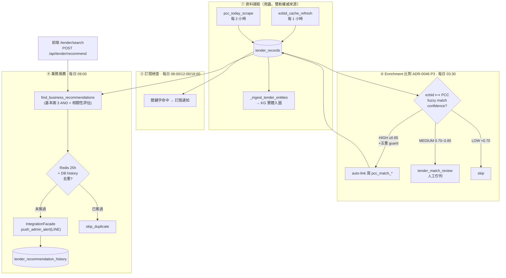
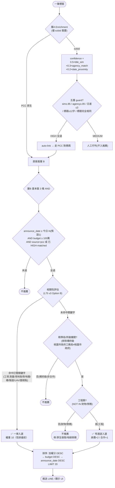

# 標案業務推薦 — 整體流程架構與評估基準

> **範圍**：`/tender/search` 業務推薦端到端（資料擷取 → enrichment 比對 → 業務推薦 → LINE 推送）
> **權威來源**：本文件彙整自現行程式碼，與實作同步。
> **關聯**：ADR-0046（ezbid↔PCC enrichment）/ `LESSONS_REGISTRY.md#L75`（推薦相關性根因）
> **最後更新**：2026-06-16（v3 Option B「關鍵字優先＋機關窄通道」落地）

---

## 1. 入口與共用邏輯

| 入口 | 觸發 | 說明 |
|---|---|---|
| `POST /api/tender/recommend` | 前端 `/tender/search` 推薦頁 | 即時查推薦清單 |
| cron `tender_business_recommend` | 每日 09:00 | 篩選 → 去重 → LINE 推送 admin |

> 兩端**共用** `business_recommendation.find_business_recommendations()`（單一 SSOT），避免雙軌漂移。

---

## 1.5 統計口徑 SSOT（2026-06-17 完整複查定案，避免反覆漂移）

> 所有「標案數量」一律 **DB 同源 + 去重 job_number**（共用 `count_complete_tenders` / `fetch_complete_tenders`，kind=opportunity/award/failed/rfp）。
> **嚴禁**用 live 爬蟲計數（只抓今日→本週嚴重低估、決標停留舊月）或 raw `COUNT(*)`（未去重虛高）。

| 指標 | 定義（去重 job_number） | 時間單元 | 現值範例 |
|---|---|---|---|
| **今日標案 / 今日最新** | 完整標案機會（含報價單/企劃書，排除決標結果類）| **日**（唯一）| 1237 |
| **本週標案** | 同上 | 週(近7日) | 8020 |
| **本週決標** | 決標公告（排無法決標）| 週(近7日) | 15 |
| **無法決標** | 無法決標公告 | 週(近7日) | 0 |
| **公開徵求** | 公開取得報價單/企劃書（為「標案機會」之子集）| 週(近7日) | 1783 |
| **業務推薦** | 相關性過濾（見 §5）| 近7日 | 37 |

- **一致性鐵則**：`/tender/search`「今日最新」= `/tender/dashboard`「今日標案」（皆 `count_complete_tenders(0)`，用 **count 非清單長度**，避免 list `LIMIT` 截斷）。
- dashboard 卡片**僅「今日標案」為日單元，其餘皆週**（owner 定案）；已移除與「本週決標」重複的「最新決標」卡。
- 日期範圍標籤由端點計算（今日「06-17」/週「06-11~06-17」），不沿用爬蟲陳舊範圍。

---

## 2. 整體流程架構（Mermaid）



---

## 3. 評估基準對照流程圖（Mermaid）

> 兩個獨立評分層：**層 A** 決定「ezbid 能否升格走 PCC 權威資料」；**層 B** 決定「哪些標案推給業務」。



---

## 4. 層 A — Enrichment 比對基準（`enrichment.py`）

**信心公式**（與 audit 腳本一致）：
```
confidence = 0.5 × title_sim(pg_trgm)
           + 0.3 × agency_match(unit_name 完全相同=1.0 / 相似>0.7 取相似度 / 否則 0)
           + 0.2 × date_proximity(±3日=1.0 / ±7日=0.5 / 否則 0)
```
| 等級 | 閾值 | 處置 |
|---|---|---|
| HIGH | ≥ 0.85 **且**過五重 guard | auto-link（寫 `pcc_match_*` 4 欄位） |
| MEDIUM | 0.70–0.85 | 進 `tender_match_review` 人工佇列 |
| LOW | < 0.70 | skip |

**五重 guard（防 trigram 短字串假陽性，5/28 實戰升級）**：
1. `title_sim ≥ 0.85`　2. `agency_match ≥ 0.85`　3. `date_proximity = 1.0`（≤3 日）
4. ezbid/PCC 標題長度皆 **≥ 12 字**　5. **標題完全相同（exact match）** 才 auto-link

---

## 5. 層 B — 業務推薦 篩選/評分（`business_recommendation.py` v3 Option B）

### 基本面 3 條（AND，無條件必須）
1. **時間窗**：`announce_date ≥ 今日 − days_back`（預設 1 日）
2. **預算門檻**：`budget ≥ budget_min`（預設 100 萬）
3. **來源**：`source='pcc'` OR `pcc_match_unit_id IS NOT NULL`（HIGH-matched ezbid 走 PCC 對應碼）

### 相關性評估（L75：關鍵字＝工項為主、機關為輔窄通道）
| 路徑 | 條件 | 入選 | 權重 |
|---|---|---|---|
| **關鍵字（工項，含同義詞）** | **title** 命中訂閱關鍵字或其同義詞（L75.2 只比對 title，不比對 unit_name）<br/>**AND 非財物類 AND 非負面關鍵字**（L75.3）<br/>**不受預算門檻**（L75.1，工項小案如圖根點常 NULL/小額預算）| 入選 | **10** |
| **機關窄通道** | **精準局/所級**（排除裸府級）**AND 工程類**（NOT IN 財物/勞務）**AND 預算 ≥ budget_min** | 窄通道入選 | 承攬 **2** / 合作 **1** |

**排除機制（L75.3，2026-06-17）— 評估後採「負面關鍵字」而非 AI**：
- **為何不用 AI**：負面關鍵字精準、零成本、即時、owner 可自維；AI 篩選慢/有成本/不確定，殺雞用牛刀。
- **為何不能只靠 category**：儀器/醫療採購案在 PCC 常被標「勞務」或「財物」或空（且去重選版本不定）→ category 不可靠 → 改按 **title 負面關鍵字**攔截。
- **機制**：①關鍵字路徑排除 `category=財物` ②`synonyms.yaml` 的 `tender_keyword_exclusions`（測量儀/儀器設備/經緯儀/試劑/血紅素/磅秤/液位計/檢測儀…，**owner 發現新誤判即加一詞，不需改碼**）。
- **解過的誤判**：國土測繪中心資安 MDR（unit_name 誤命中→title-only 修）、血流量/濃度/雷射測量儀（儀器採購→負面關鍵字）。

- **現行訂閱關鍵字（7）**：`UAV / 圖根點 / 圖解數化地籍 / 測量 / 用地取得 / 都市計畫樁 / 隧道`
- **同義詞展開（L75，2026-06-16）**：訂閱清單維持精簡（只放主詞），比對時自動展開整組同義詞 → 避免增列過多訂閱關鍵字/篩選類別。群組維護於 `synonyms.yaml` 的 `tender_keyword_synonyms`（如 `UAV → 無人機/空拍機/drone`），由 `_expand_keyword_terms()` 載入；**新增同義詞＝改 yaml，不動訂閱清單**。實證：近 60 日 32 筆「無人機/空拍」標案無 `UAV` 字樣，展開後可接到。
- **精準機關**：`government_agencies` / `contract_projects.client_agency` 排除 `NOT LIKE '%政府'`（裸府級），並正規化 unicode 髒資料（部首字 `⼯` U+2F37 → `工`）
- **排序**：加權分 DESC（關鍵字 10 恆居首）→ budget DESC → announce_date DESC → LIMIT 20

### 為何這樣設計（根因，L75）
機關（即使精準到局）會發包**大量公司不做的工項**（護岸/道路/漁港/保險/地磅）；唯一可靠的相關性訊號是**工項＝關鍵字**。舊版（v2）讓機關信號可粗放獨立入選 + 在裸府級命中 → 每日推 10 案皆公司無涉略。v3 將關鍵字設為主路徑、機關降為精準窄通道。

### 殘留限制
- 機關窄通道仍可能放行「精準局/所級的工程新案（非關鍵字）」少量（如 `桃園市政府工務局` 道路改善）——屬刻意保留（已合作局處的新工程值得 heads-up）。
- 測量/技術服務（PCC 常歸「勞務」類）靠**關鍵字路徑**接，不走機關窄通道。
- 若仍嫌寬，可升 **Option A（關鍵字為硬門檻，機關僅排序/UI 不入推送）**——一行 SQL 之差。

---

## 6. 去重 / 觀測 / 透明化
- **去重**：Redis `tender:recommend:pushed:{unit_id}:{job}`（TTL 25h）+ DB `tender_recommendation_history`（全留底含 error）。
- **觀測**：Prometheus `recommend_total{result=found|pushed|skipped_duplicate|error}` + `recommend_last_run`。
- **透明化**：LINE 訊息顯示推薦原因（🔍訂閱命中 / 📜歷史承攬 / 🤝合作 N 次）+ 雙連結（missive 詳情 + PCC 官方採購網）。

## 7. 已知限制 / 警示
1. **PCC budget 大量 NULL**：實際靠 HIGH-matched ezbid（持 budget）撐預算門檻；見 `TENDER_PCC_COVERAGE_AUDIT_20260529.md`。
2. **資料新鮮度**：PCC 決標部分依 g0v API（1–5 天延遲）；scraper 曾因缺 cron silent dormant（已補 watchdog）。
3. **權威分層**：ezbid 量大品質弱、PCC 權威但 budget 常缺 → enrichment 五重 guard 是嫁接安全紅線。

---

## 附錄 A — 文件 Mermaid 圖政策（「wikicode」概念評估）

> 結論：**採分級指引，不一律強制**（避免形式主義 / 範本污染 / 圖 stale 比沒圖更誤導，見 `LESSONS_REGISTRY.md#L73`）。

| 該用 Mermaid ✅ | 不該硬塞 ❌ |
|---|---|
| 流程 / 狀態機 / 資料管線 | 純清單 / 設定對照表 |
| 架構分層 / 決策樹 | 單一函式 / API 欄位說明 |
| 跨服務時序（如 SSO bootstrap、本推薦流程） | 一次性備忘 |

**判準**：圖能省 ≥ 30% 理解成本才畫。**治理掛鉤**：Mermaid 區塊應隨程式碼變更同步更新（納入文件漂移偵測），否則 stale 圖誤導 > 無圖。

---

## 附錄 B — 標案資料現實與 Enrichment 可行性定論（2026-06-17，防日後重試被封路徑）

> **結論：server 端 PCC 詳情 enrichment（採購性質/底價/決標/廠商）不可行，已徹底驗證。勿再投入爬蟲路徑。**

**資料現實**：tender_records 僅有「今日招標公告基本欄位」（title/unit_name/job_number/deadline/source；多 NULL budget/category）。我方 `unit_id` 實為 PCC `pkPmsMain`（base64）。

**官方直連（可用，已修）**：`https://web.pcc.gov.tw/tps/QueryTender/query/searchTenderDetail?pkPmsMain=<unit_id>`，**base64 尾 `=` 須保留原樣**（編成 `%3D` 會落精簡 stub 頁）→ `quote(safe='=')`。使用者瀏覽器點擊可看完整官方頁（不受我方伺服 IP 反爬限制）。

**Enrichment 死結（實證，勿重試）**：
| 路徑 | 結果 |
|---|---|
| openfun API（不限流、回乾淨採購性質/預算/底價/廠商）| 需「點分 org_id」（如 A.13.6.20 / 3.5.48）|
| 點分 org_id 來源 | **僅在 PCC 詳情頁**；今日清單頁/ezbid/openfun by-date 皆無 |
| PCC 詳情頁逐案抓 | **端點層反爬限流**：少量請求後即回 13–49KB stub（無 org_id），curl/httpx/補 headers/換 UA/session+Referer/原始= 皆然 → `searchTenderDetail` 對我方伺服 IP 限流。**註：非全面 IP 封鎖**——今日清單頁(prkms/today) 仍 200/1439 筆正常、**爬蟲資料源與推薦/篩選完全不受影響**；限流為速率型、多半隨時間恢復；使用者瀏覽器(他 IP/真 session)不受限 |

→ openfun 需 org_id、org_id 只在被限流的 PCC 詳情頁、無替代源 ⇒ **採購性質/底價 server 端無法穩定取得**。DB 已加 enrichment 欄位（org_id/procurement_nature/base_price/award_result/bidders/detail_enriched_at，遷移 20260617a001，無害備用）；`detail_enrichment.py` 保留 best-effort、**不掛自動 cron**。

**因此的篩選策略（現實下最佳解）**：
- **可靠引擎＝確定性自維**（關鍵字 + 排除清單 + 承攬史建議），owner 從「關鍵訂閱→推薦規則設定」UI 自加，**即時生效、零成本、可控**。特例（血壓計/復建工程…）由 owner 自加排除。
- 詳情/底價/戰情 → 使用者點**官方直連**看 PCC 完整頁。
- 若未來真要採購性質自動化：唯一路徑＝**付費/官方 PCC 開放資料授權或合法代理 API**（非爬蟲），屬採購決策。

---

## 變更紀錄
| 日期 | 版本 | 變更 |
|---|---|---|
| 2026-05-28 | v1（ADR-0046 P4） | 業務推薦 LINE 通知首版 |
| 2026-05-29 | v2（L51.4/.6） | 三重信號 OR + 財物雜訊過濾 |
| 2026-06-16 | **v3（L75 Option B）** | 關鍵字優先（權重10）+ 機關精準局/所級窄通道（排裸府級 + unicode 正規化 + 限工程類）；解「推送皆無涉略」 |
| 2026-06-16 | v3.1（L75 同義詞/卡片語意）| 訂閱關鍵字同義詞展開（synonyms.yaml）；今日最新=活動量 / 業務推薦=相關；今日標案口徑含報價單去重 |
| 2026-06-17 | **v4（完整複查定案）** | 統計口徑 SSOT（全週單元除今日標案、DB 同源去重、移除重複最新決標卡、修決標停留舊月）；業務推薦 L75.1 關鍵字不受預算門檻（圖根點）+ L75.2 只比對 title + L75.3 排除機制（財物+負面關鍵字，非 AI）；今日最新真 count 與 dashboard 一致（解 list 截斷）|
| 2026-06-17 | **v5（自維 UI + 官方直連 + enrichment 定論）** | 關鍵訂閱新增「推薦規則設定」UI（排除/同義詞/承攬史建議一鍵加入、即時生效免 rebuild，L75.4）；PCC 官方直連修（pkPmsMain，原始 `=`）；**enrichment 死結定論**（PCC 反爬封我方伺服 IP、org_id 無替代源 → 不投入爬蟲，見附錄 B）；DB 加 enrichment 欄位備用（遷移 20260617a001）|
