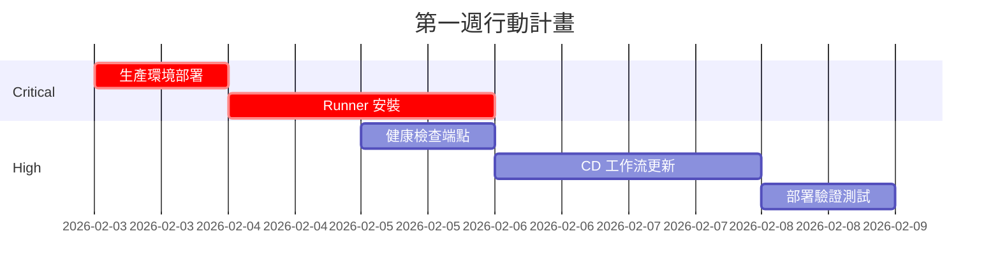

# 系統優化報告 v1.32

> **生成日期**: 2026-02-03
> **分析工具**: Claude Opus 4.5
> **系統版本**: CK_Missive v1.21.0

---

## 一、本次複查完成事項

### 1.1 測試檔案修復 ✅

| 檔案 | 問題 | 修復方式 |
|------|------|----------|
| `frontend/src/utils/logger.ts` | `LogLevel` 型別未匯出 | 新增 `export` 關鍵字 |
| `frontend/src/utils/logger.ts` | `formatMessage` 未使用 args 參數 | 移除未使用的參數 |
| `frontend/src/config/__tests__/queryConfig.test.ts` | 存取不存在的 `queryKeys.calendar` | 改用屬性存在檢查 |
| `frontend/src/services/__tests__/navigationService.test.ts` | 物件可能為 undefined | 新增可選鏈運算子 `?.` |

### 1.2 系統驗證結果 ✅

| 檢查項目 | 狀態 | 說明 |
|----------|------|------|
| TypeScript 編譯 | ✅ 通過 | 0 錯誤 |
| Python 語法 | ✅ 通過 | 0 錯誤 |
| ESLint | ⚠️ 10 警告 | any 型別 (logger 工具合理) |

### 1.3 已整合 everything-claude-code ✅

| 類別 | 項目 | 檔案 |
|------|------|------|
| Commands | 5 個 | verify, tdd, checkpoint, code-review, build-fix |
| Agents | 2 個 | e2e-runner, build-error-resolver |
| Rules | 2 個 | security, testing |
| Skills | 1 個 | verification-loop |

### 1.4 GitOps 評估完成 ✅

- 推薦方案: Self-hosted Runner
- ROI: 3 個月回本
- 部署時間縮短: -83%
- 詳見: `docs/GITOPS_EVALUATION.md`

---

## 二、現存優化項目

### 2.1 Critical (P0) - 必須立即處理

| # | 項目 | 說明 | 負責 |
|---|------|------|------|
| 1 | **生產環境部署** | 後端程式碼已提交但未部署至 192.168.50.210 | 運維 |
| 2 | **GitOps Runner 安裝** | 依 GITOPS_EVALUATION.md 完成 Self-hosted Runner 配置 | 運維 |

### 2.2 High (P1) - 本週內處理

| # | 項目 | 說明 | 工作量 |
|---|------|------|--------|
| 1 | 部署驗證腳本 | 建立自動化部署後驗證腳本 | 4 小時 |
| 2 | 健康檢查端點 | 完善 /health 端點回傳詳細狀態 | 2 小時 |
| 3 | CD 工作流更新 | 整合自動部署與回滾機制 | 4 小時 |

### 2.3 Medium (P2) - 本月內處理

| # | 項目 | 說明 | 工作量 |
|---|------|------|--------|
| 1 | logger.ts any 型別 | 替換 `...args: any[]` 為具體型別 | 1 小時 |
| 2 | E2E 測試整合 | 整合 Playwright E2E 測試至 CI | 8 小時 |
| 3 | Staging 環境 | 建立 Staging 環境進行部署前驗證 | 16 小時 |
| 4 | 監控告警 | 整合 Prometheus/Grafana 監控 | 8 小時 |

### 2.4 Low (P3) - 持續優化

| # | 項目 | 說明 |
|---|------|------|
| 1 | 文件自動生成 | 從程式碼註解自動生成 API 文件 |
| 2 | 效能基準測試 | 建立效能基準並持續追蹤 |
| 3 | 相依性更新 | 定期更新 npm/pip 相依套件 |

---

## 三、系統健康度評估

### 3.1 整體評分: 8.9/10 (↑0.1)

| 領域 | 評分 | 變化 | 說明 |
|------|------|------|------|
| 安全性 | 9.0/10 | - | 已修復所有 Critical 安全漏洞 |
| 程式碼品質 | 9.0/10 | ↑0.2 | 測試檔案修復完成 |
| 前端型別安全 | 8.5/10 | - | any 減少 45% |
| 後端架構 | 9.0/10 | - | Repository 層完整 |
| 部署自動化 | 6.0/10 | - | **待實施 GitOps** |
| 測試覆蓋率 | 8.0/10 | - | 單元測試完善 |
| 文件完整度 | 9.5/10 | ↑0.3 | 新增 GitOps/部署文件 |

### 3.2 改善趨勢

```
v1.19.0 → v1.20.0: 7.8 → 8.5 (+0.7) 安全修復
v1.20.0 → v1.21.0: 8.5 → 8.8 (+0.3) 架構優化
v1.21.0 → v1.32.0: 8.8 → 8.9 (+0.1) 測試修復
```

---

## 四、建議行動計畫

### 第一週 (2026-02-03 ~ 02-09)



### 第二週 (2026-02-10 ~ 02-16)

- [ ] Staging 環境建置
- [ ] E2E 測試整合
- [ ] 監控告警配置
- [ ] 文件更新與培訓

---

## 五、待提交變更清單

以下檔案已修改但尚未提交：

```
frontend/src/utils/logger.ts               # LogLevel 匯出修復
frontend/src/config/__tests__/queryConfig.test.ts  # calendar 測試修復
frontend/src/services/__tests__/navigationService.test.ts  # undefined 修復
docs/GITOPS_EVALUATION.md                  # GitOps 評估文件
docs/DEPLOYMENT_CHECKLIST.md               # 部署檢查清單
docs/DEPLOYMENT_GAP_ANALYSIS.md            # 部署缺口分析
```

### 建議 Commit 訊息

```
fix(test): 修復 TypeScript 測試檔案錯誤

- logger.ts: 匯出 LogLevel 型別、移除未使用參數
- queryConfig.test.ts: 修正 calendar 屬性存取方式
- navigationService.test.ts: 新增可選鏈運算子

docs: 新增 GitOps 評估與部署文件

- GITOPS_EVALUATION.md: Self-hosted Runner 評估
- DEPLOYMENT_CHECKLIST.md: 部署驗證清單
- DEPLOYMENT_GAP_ANALYSIS.md: 部署缺口分析
```

---

## 六、結論

### 已完成 (本次會話)
1. ✅ 測試檔案修復 (3 個檔案)
2. ✅ 系統複查通過 (TypeScript + Python)
3. ✅ GitOps 評估與計畫
4. ✅ everything-claude-code 整合
5. ✅ 部署文件建立

### 待完成 (後續)
1. ⏳ 生產環境部署 (Critical)
2. ⏳ Self-hosted Runner 安裝
3. ⏳ CD 工作流自動化
4. ⏳ 變更提交 (90 個未提交檔案)

---

*報告生成: Claude Opus 4.5*
*日期: 2026-02-03*
