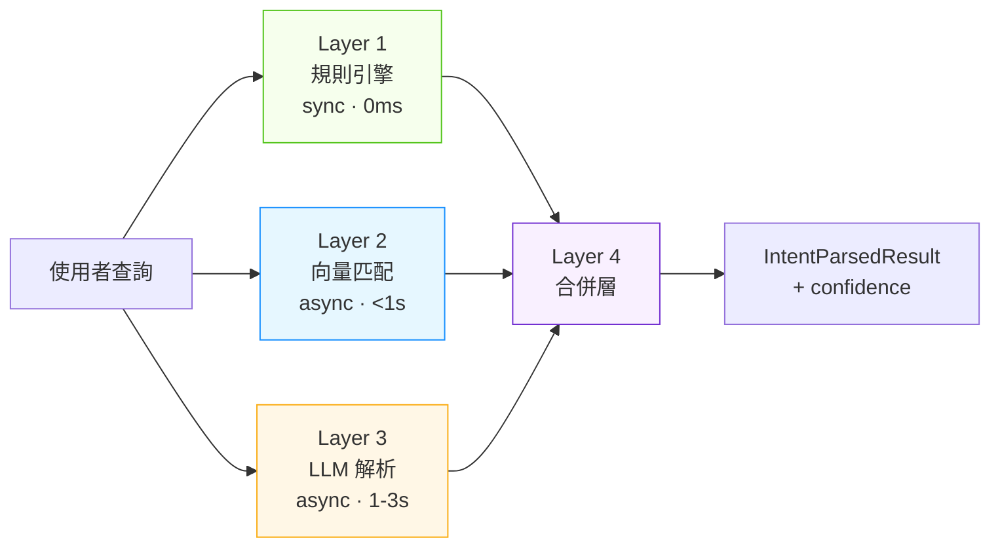
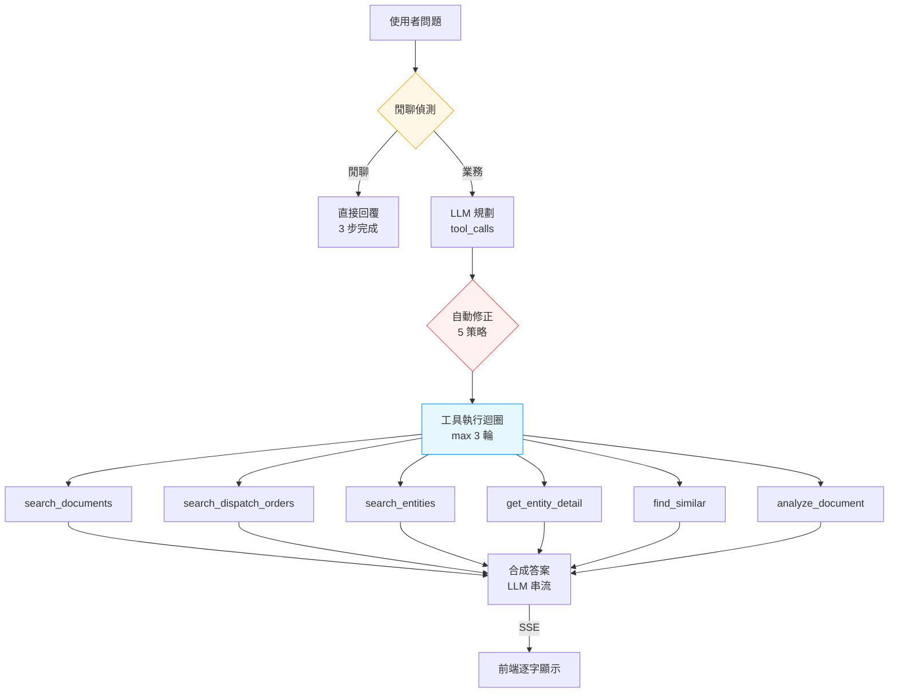
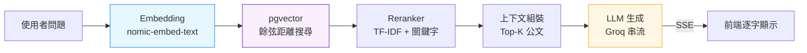

# AI 搜尋與問答管線架構圖

CK_Missive 的 AI 子系統包含三條主要管線：四層搜尋意圖解析、Agent 工具編排、RAG 問答。

> 最後更新：2026-02-27 | 關聯：[ADR-0007](../adr/0007-four-layer-ai-architecture.md), [ADR-0009](../adr/0009-agent-rule-based-self-correction.md)

## 1. 四層搜尋意圖解析



| Layer | 元件 | 處理 | 延遲 |
|-------|------|------|------|
| 1 | `rule_engine.py` | 正則：文號、日期、狀態碼 | 0ms |
| 2 | `search_entity_expander.py` | pgvector 餘弦距離 + 同義詞 | <1s |
| 3 | `search_intent_parser.py` | Groq/Ollama JSON 結構化輸出 | 1-3s |
| 4 | 合併邏輯 | 衝突解決 + 信心度計算 | <1ms |

## 2. Agent 工具編排



### Agent 自動修正策略

| # | 策略 | 觸發條件 | 動作 |
|---|------|---------|------|
| 1 | 空計劃恢復 | LLM 回傳無效 JSON | 用 SearchIntentParser hints 建構 tool_calls |
| 2 | 派工單偵測 | 正則匹配派工單號 | 強制加入 `search_dispatch_orders` |
| 2.5 | 零結果重試 | search_documents 0 結果 + 派工關鍵字 | 自動加 `search_dispatch_orders` |
| 4 | 實體展開 | search_entities 有結果 | 自動展開 `get_entity_detail` |
| 5 | 實體類型映射 | LLM 自然語言類型 | 映射到 DB 縮寫 |

## 3. RAG 問答管線



### SSE 串流協議

```
Event 1:  {"type": "sources", "data": [...]}     ← 來源公文
Event 2+: {"type": "token", "data": "字"}        ← 逐字回答
Event N:  {"type": "done", "data": {...}}         ← 完成
Event E:  {"type": "error", "data": "message"}    ← 錯誤
```
