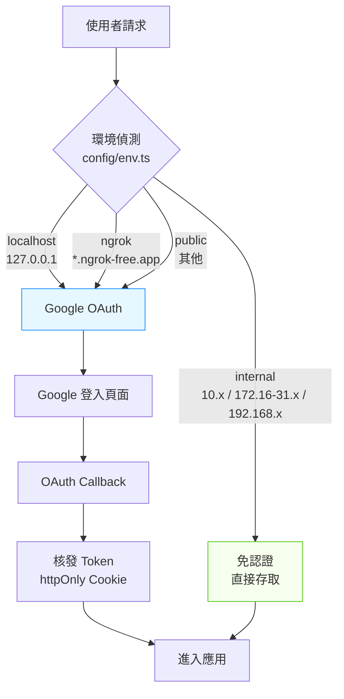
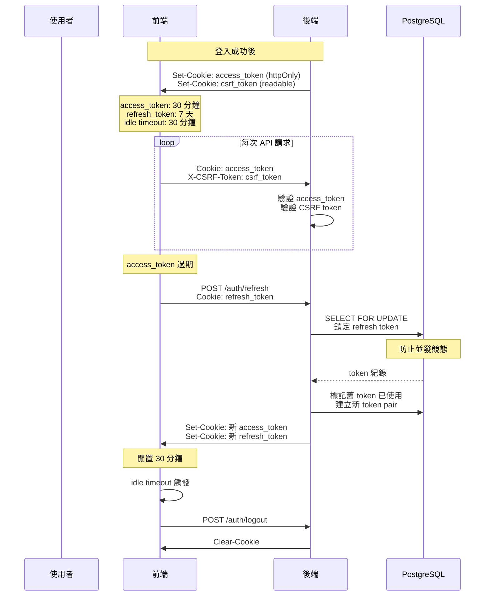

# 認證與授權流程圖

四種環境的認證策略、Token 生命週期、以及 Refresh Token Rotation 機制。

> 最後更新：2026-02-27 | 關聯：[ADR-0002](../adr/0002-httponly-cookie-csrf-auth.md), [ADR-0003](../adr/0003-internal-network-auth-bypass.md)

## 環境偵測與認證分流

## Token 生命週期

## 安全機制摘要

| 威脅 | 防護 | 實作 |
|------|------|------|
| XSS Token 竊取 | httpOnly Cookie | access_token 不可被 JS 讀取 |
| CSRF 攻擊 | Double-Submit Cookie | `csrf_token` 可讀 + `X-CSRF-Token` header |
| Token 重放 | Refresh Token Rotation | 每次 refresh 產生新 pair，舊的標記已用 |
| 並發競態 | `SELECT FOR UPDATE` | 資料庫鎖防止同時 refresh |
| Session 劫持 | Idle Timeout | 30 分鐘無操作自動登出 |
| 內網攻擊 | IP 白名單 | 僅 RFC 1918 私有 IP 範圍免認證 |
