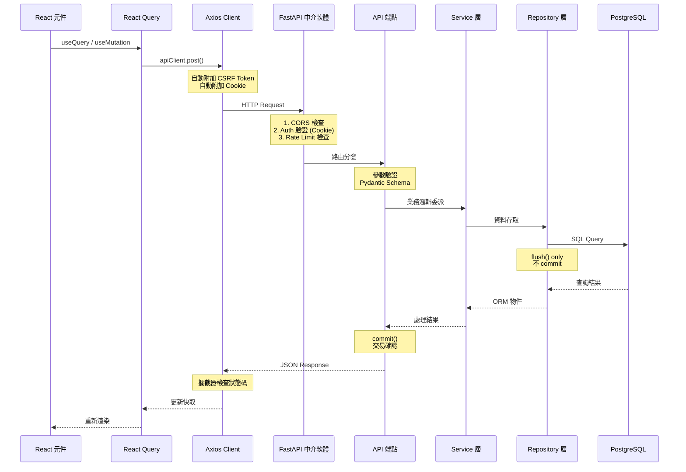
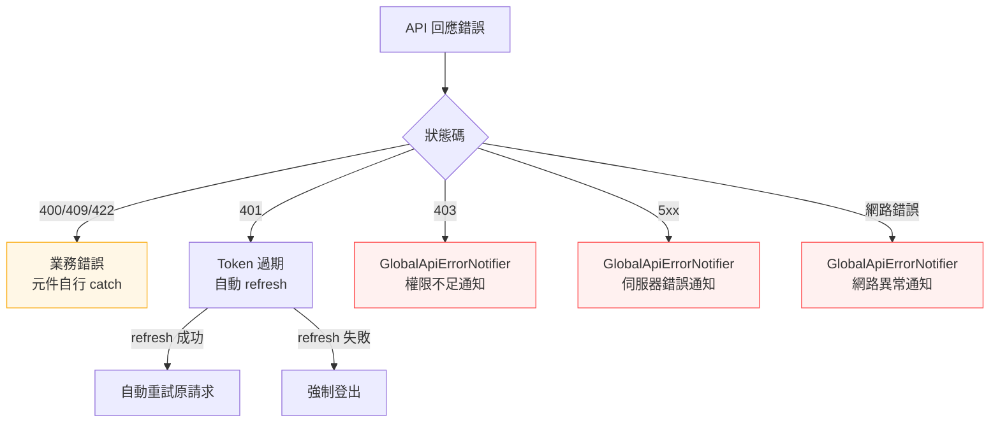

# 請求生命週期資料流圖

從前端元件到資料庫的完整請求路徑，標示每層的職責與錯誤處理機制。

> 最後更新：2026-02-27 | 關聯：[ADR-0004](../adr/0004-ssot-type-architecture.md), [ADR-0008](../adr/0008-repository-flush-only-strategy.md)

## 正常請求流程

## 錯誤處理分流

| 錯誤類型 | 處理者 | 行為 |
|---------|--------|------|
| 400/409/422 | 元件 `catch` | 顯示業務錯誤訊息 |
| 401 | Axios 攔截器 | 自動 refresh token → 重試 |
| 403 | `GlobalApiErrorNotifier` | 全域通知「權限不足」 |
| 5xx | `GlobalApiErrorNotifier` | 全域通知「伺服器錯誤」（3 秒去重） |
| 網路錯誤 | `GlobalApiErrorNotifier` | 全域通知「網路異常」 |

## 關鍵路徑檔案

| 層級 | 檔案 | 職責 |
|------|------|------|
| 前端 Hook | `src/hooks/use*.ts` | React Query 封裝 |
| API Client | `src/api/client.ts` | Axios 實例 + 攔截器 |
| 錯誤匯流排 | `src/api/errors.ts` | `ApiErrorBus` 事件發射 |
| 全域通知 | `src/components/common/GlobalApiErrorNotifier.tsx` | 訂閱 + 顯示 |
| 後端端點 | `backend/app/api/endpoints/` | 參數驗證 + commit |
| Service | `backend/app/services/` | 業務邏輯 |
| Repository | `backend/app/repositories/` | ORM 查詢 + flush |
