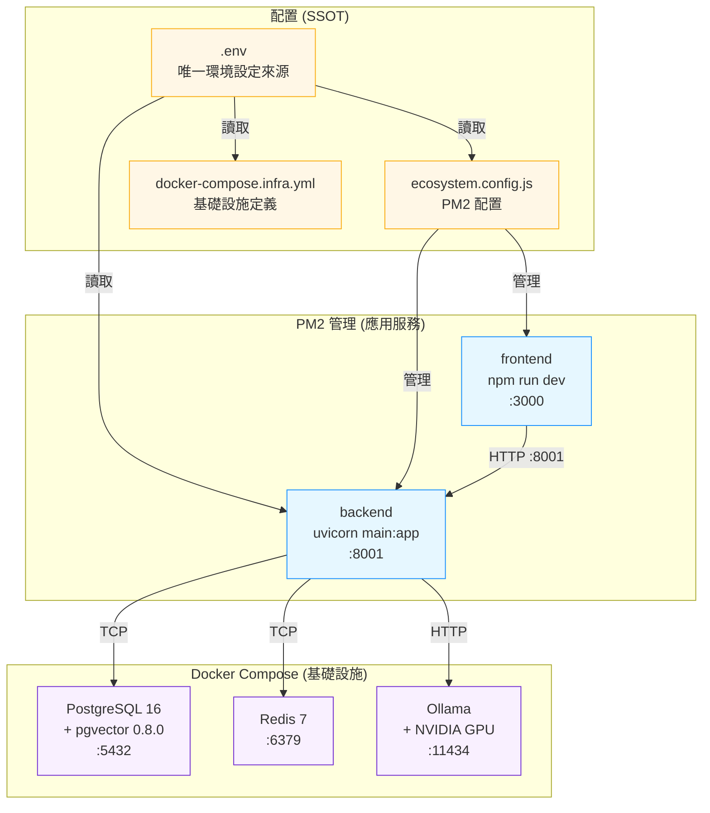
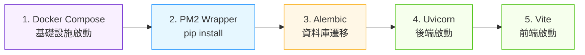

# 混合部署拓撲圖

Docker Compose 管理基礎設施，PM2 管理應用服務。所有配置以根目錄 `.env` 為唯一來源。

> 最後更新：2026-02-27 | 關聯：[ADR-0005](../adr/0005-mixed-mode-deployment.md)

## 部署拓撲

## 啟動順序

## 常用管理命令

| 動作 | 命令 |
|------|------|
| 混合模式啟動 | `.\scripts\dev-start.ps1` |
| 查看服務狀態 | `.\scripts\dev-start.ps1 -Status` |
| 停止所有服務 | `.\scripts\dev-stop.ps1` |
| 僅停 PM2 保留 DB | `.\scripts\dev-stop.ps1 -KeepInfra` |
| 全 Docker 模式 | `.\scripts\dev-start.ps1 -FullDocker` |

## GPU 配置（Ollama）

| 項目 | 規格 |
|------|------|
| GPU | NVIDIA RTX 4060 |
| VRAM | 8 GB |
| Embedding 模型 | nomic-embed-text（~0.5 GB） |
| Chat 模型 | qwen3:4b（~2.5 GB） |
| 剩餘 VRAM | ~5 GB（可再載入模型） |

## Windows 編碼防護

`PYTHONUTF8=1` 必須在三個位置設定：

1. **`.env`** — 後端直接讀取
2. **`ecosystem.config.js`** — PM2 環境變數
3. **`startup.py`** — subprocess 子程序
