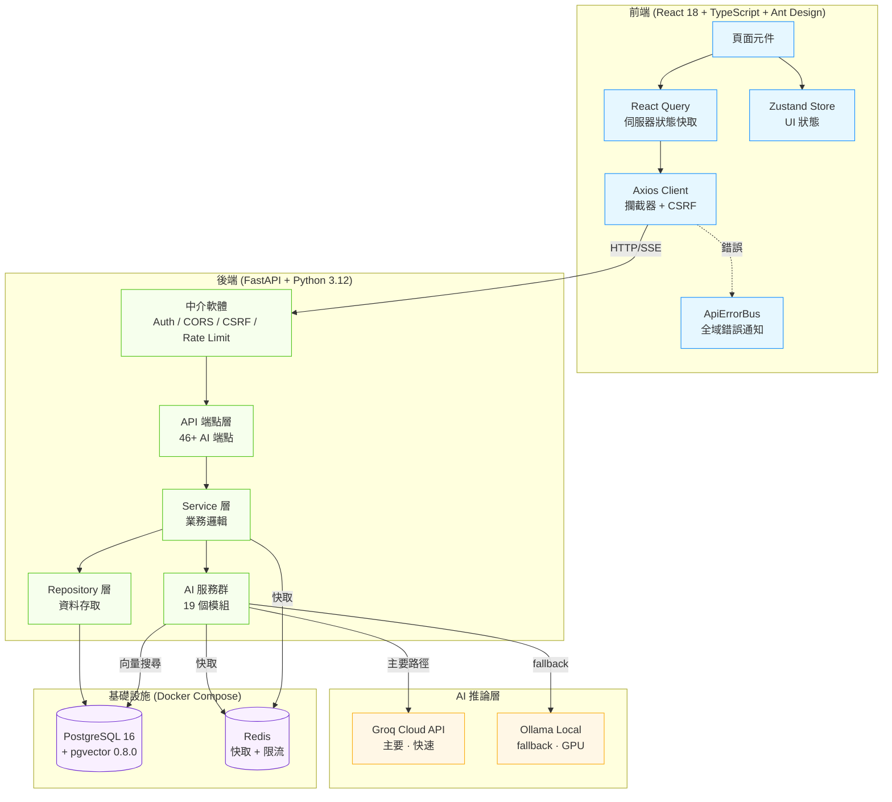

# 系統全景架構圖

CK_Missive 公文管理系統的完整技術架構。前端 React SPA 透過 Axios 與 FastAPI 後端通訊，
後端連接 PostgreSQL（含 pgvector）、Redis 快取、以及 AI 推論服務（Groq 雲端 + Ollama 本地）。

> 最後更新：2026-02-27 | 關聯：[ADR-0001](../adr/0001-groq-primary-ollama-fallback.md), [ADR-0005](../adr/0005-mixed-mode-deployment.md)

## 元件說明

| 層級 | 元件 | 技術 | 說明 |
|------|------|------|------|
| 前端 | React Query | `@tanstack/react-query` | 伺服器狀態快取與自動同步 |
| 前端 | Zustand | `zustand` | 輕量 UI 狀態管理 |
| 前端 | ApiErrorBus | 自建 | 全域錯誤事件匯流排（403/5xx/網路） |
| 後端 | API 端點 | FastAPI | 46+ AI 端點 + 業務端點 |
| 後端 | AI 服務群 | 19 個模組 | 見 [ai-pipeline.md](ai-pipeline.md) |
| AI | Groq | 雲端 API | 主要推論（免費額度，sub-second） |
| AI | Ollama | 本地 GPU | RTX 4060 8GB，qwen3:4b + nomic-embed-text |
| 基礎設施 | PostgreSQL | Docker | 含 pgvector 768D 向量搜尋 |
| 基礎設施 | Redis | Docker | 快取 + Rate Limit 計數器 |
