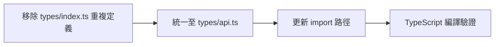
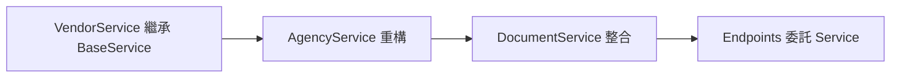
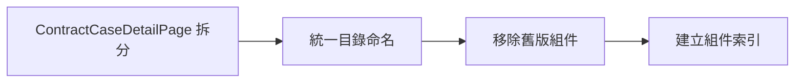

# 系統架構審查報告 (System Architecture Review)

> 版本：1.1.0
> 審查日期：2026-01-06
> 最後更新：2026-01-06
> 專案：CK_Missive 公文管理系統

---

## 一、系統架構概覽

### 1.1 整體架構

```
┌─────────────────────────────────────────────────────────────────────────┐
│                          CK_Missive 系統架構                              │
├─────────────────────────────────────────────────────────────────────────┤
│                                                                         │
│  ┌─────────────────────────────────────────────────────────────────┐   │
│  │                      Frontend (React + TypeScript)                │   │
│  │  ┌───────────┐  ┌───────────┐  ┌───────────┐  ┌───────────┐     │   │
│  │  │   Pages   │  │Components │  │    API    │  │   Types   │     │   │
│  │  │  (38+)    │  │  (8 dirs) │  │  (12 files)│  │  (3 files)│     │   │
│  │  └───────────┘  └───────────┘  └───────────┘  └───────────┘     │   │
│  └─────────────────────────────────────────────────────────────────┘   │
│                                    │                                    │
│                                    ▼                                    │
│  ┌─────────────────────────────────────────────────────────────────┐   │
│  │                     Backend (FastAPI + SQLAlchemy)                │   │
│  │  ┌───────────┐  ┌───────────┐  ┌───────────┐  ┌───────────┐     │   │
│  │  │ Endpoints │  │ Services  │  │  Schemas  │  │  Models   │     │   │
│  │  │  (28 files)│  │ (12 files)│  │ (16 files)│  │  (1 file) │     │   │
│  │  └───────────┘  └───────────┘  └───────────┘  └───────────┘     │   │
│  └─────────────────────────────────────────────────────────────────┘   │
│                                    │                                    │
│                                    ▼                                    │
│  ┌─────────────────────────────────────────────────────────────────┐   │
│  │                       Database (PostgreSQL)                       │   │
│  │                         15+ Tables                                │   │
│  └─────────────────────────────────────────────────────────────────┘   │
│                                                                         │
└─────────────────────────────────────────────────────────────────────────┘
```

### 1.2 技術棧

| 層級 | 技術 | 版本 |
|------|------|------|
| Frontend | React + TypeScript + Ant Design | React 18.x |
| Build Tool | Vite | 5.4.x |
| Backend | FastAPI + SQLAlchemy (Async) | FastAPI 0.100+ |
| Database | PostgreSQL | 14+ |
| ORM | SQLAlchemy 2.0 (AsyncIO) | 2.0+ |
| API Style | POST-only (資安機制) | - |

---

## 二、已識別問題與錯誤

### 2.1 型別不一致問題

#### 問題 A：前端型別重複定義

```
問題位置:
- frontend/src/types/index.ts     (Document 介面)
- frontend/src/api/documentsApi.ts (Document 介面)
- frontend/src/types/api.ts       (OfficialDocument 介面)

影響:
- 同一實體有 3 種不同的型別定義
- 維護困難，容易造成不一致
```

**建議方案**:
```typescript
// 統一在 types/api.ts 定義業務型別
// documentsApi.ts 只 import 不重複定義
import type { OfficialDocument as Document } from '../types/api';
```

#### 問題 B：ID 型別不一致

| 位置 | 欄位 | 目前型別 | 應有型別 |
|------|------|----------|----------|
| `types/index.ts` | `BaseEntity.id` | `string` | `number` |
| `types/api.ts` | `*.id` | `number` | `number` ✓ |
| `documentsApi.ts` | `Document.id` | `number` ✓ | `number` ✓ |

**影響**: `BaseEntity` 使用 `string` ID，但實際資料庫使用 `number`

#### 問題 C：欄位命名風格不一致

```typescript
// types/index.ts - 使用 camelCase
interface PaginatedResponse<T> {
  hasNextPage: boolean;  // camelCase
  hasPrevPage: boolean;
}

// api/types.ts - 使用 snake_case (與後端對應)
interface PaginationMeta {
  has_next: boolean;     // snake_case
  has_prev: boolean;
}
```

**建議**: 統一使用 snake_case 與後端對應

### 2.2 服務層問題

#### 問題 D：BaseService 未被充分利用 ✅ 已解決

```python
# ✅ 已修正：VendorService 現在繼承 BaseService
class VendorService(BaseService[PartnerVendor, VendorCreate, VendorUpdate]):
    def __init__(self):
        super().__init__(PartnerVendor, "廠商")

# ✅ 已修正：AgencyService 現在繼承 BaseService
class AgencyService(BaseService[GovernmentAgency, AgencyCreate, AgencyUpdate]):
    def __init__(self):
        super().__init__(GovernmentAgency, "機關")
```

**服務繼承狀態**:
- ✅ `VendorService` - 已繼承 BaseService
- ✅ `AgencyService` - 已繼承 BaseService
- `DocumentService` (部分方法) - 待重構

#### 問題 E：Services 與 Endpoints 職責混淆 ✅ 已解決

```python
# ✅ 已修正：projects.py endpoints 現在委託給 Service
@router.post("/years")
async def get_project_years(
    db: AsyncSession = Depends(get_async_db),
    project_service: ProjectService = Depends(get_project_service)
) -> SuccessResponse:
    years = await project_service.get_year_options(db)  # ✅ 委託服務層
    return SuccessResponse(success=True, data={"years": years})

# ProjectService 新增方法:
# - get_year_options()
# - get_category_options()
# - get_status_options()
```

### 2.3 前端架構問題

#### 問題 F：組件目錄結構混亂

```
frontend/src/components/
├── document/        # 小寫 (新版)
├── Documents/       # 大寫 (舊版)
├── extended/        # 用途不明
└── ...
```

**建議**: 統一為小寫目錄名，移除或整合 `Documents/`

#### 問題 G：頁面檔案過大

| 檔案 | 行數 | 問題 |
|------|------|------|
| `ContractCaseDetailPage.tsx` | 71,334 bytes | 超大，需拆分 |
| `ContractCasePage.tsx` | 25,957 bytes | 偏大 |
| `DatabaseManagementPage.tsx` | 25,541 bytes | 偏大 |

**建議**: 拆分為多個子組件

---

## 三、模組化程度分析

### 3.1 後端服務層模組化評估 (更新於 2026-01-06)

| 服務 | 繼承 BaseService | CRUD 完整性 | 業務邏輯分離 | 評分 |
|------|------------------|-------------|--------------|------|
| DocumentService | 部分 | ✓ | 中等 | B |
| ProjectService | 否 | ✓ | 良好 | B+ |
| VendorService | ✅ 是 | ✓ | 優秀 | A- |
| AgencyService | ✅ 是 | ✓ | 優秀 | A- |
| BaseService | - | ✓ | 優秀 | A |

### 3.2 前端 API 層模組化評估

| API 模組 | 型別定義 | 錯誤處理 | 回應標準化 | 評分 |
|----------|----------|----------|------------|------|
| documentsApi | 完整 | ✓ | ✓ | A- |
| projectsApi | 完整 | ✓ | ✓ | A- |
| vendorsApi | 完整 | ✓ | ✓ | B+ |
| client.ts | - | ✓ | ✓ | A |

### 3.3 Schema 對應完整性

```
Database → Models → Schemas → Frontend Types

OfficialDocument:
  ✓ delivery_method
  ✓ has_attachment
  ✓ contract_project_id
  ✓ contract_project_name (計算欄位)
  ✓ assigned_staff (關聯資料)
  ✓ auto_serial (型別修正: int → str)

ContractProject:
  ✓ project_code
  ✓ category
  ✓ case_nature
  ✓ client_agency_id
```

---

## 四、優化建議與規劃

### 4.1 優先級 P0 (Critical) - ✅ 已完成

| # | 問題 | 建議方案 | 狀態 |
|---|------|----------|------|
| 1 | 型別重複定義 | 統一 Document 型別定義位置 | ✅ 完成 |
| 2 | ID 型別不一致 | 修正 BaseEntity.id 為 number | ✅ 完成 |
| 3 | ContractCaseDetailPage 過大 | 拆分為子組件 | 待處理 |

### 4.2 優先級 P1 (High) - ✅ 已完成

| # | 問題 | 建議方案 | 狀態 |
|---|------|----------|------|
| 4 | Services 未繼承 BaseService | 重構 VendorService, AgencyService | ✅ 完成 |
| 5 | Endpoints 直接查詢 DB | 抽取至 Service 層 | ✅ 完成 |
| 6 | 組件目錄命名不一致 | 統一為小寫 | 待處理 |

### 4.3 優先級 P2 (Medium) - ✅ 已完成

| # | 問題 | 建議方案 | 狀態 |
|---|------|----------|------|
| 7 | 分頁回應格式不統一 | 統一使用 PaginatedResponse | 待處理 |
| 8 | 命名風格混用 | 統一 snake_case (與後端對應) | ✅ 完成 |
| 9 | 舊版組件未清理 | 移除 Documents/ 目錄 | 待處理 |

### 4.4 優先級 P3 (Low) - 持續改進

| # | 問題 | 建議方案 |
|---|------|----------|
| 10 | 缺少單元測試 | 建立 pytest/vitest 測試框架 |
| 11 | 缺少 API 文件 | 整合 OpenAPI/Swagger |
| 12 | 缺少錯誤監控 | 整合 Sentry 或類似服務 |

---

## 五、重構路線圖

### Phase 1: 型別統一 (1-2 天)



### Phase 2: 服務層重構 (3-5 天)



### Phase 3: 前端組件整理 (3-5 天)



---

## 六、架構改進目標

### 6.1 短期目標 (1-2 週) - 進度更新 2026-01-06

- [x] 消除型別重複定義 ✅
- [x] VendorService 繼承 BaseService ✅
- [x] AgencyService 繼承 BaseService ✅
- [x] Endpoints 不直接存取 DB ✅
- [ ] 前端目錄結構標準化

### 6.2 中期目標 (1 個月)

- [ ] API 回應格式 100% 標準化
- [ ] 單元測試覆蓋率 > 50%
- [ ] API 文件自動生成
- [ ] 錯誤處理統一機制

### 6.3 長期目標 (3 個月)

- [ ] 微服務架構評估
- [ ] CI/CD 流程完善
- [ ] 效能監控整合
- [ ] 國際化 (i18n) 支援

---

## 七、相關文件

| 文件 | 說明 |
|------|------|
| `@TYPE_CONSISTENCY_SKILL_SPEC.md` | 型別一致性規範 |
| `@SCHEMA_VALIDATION_SKILL_SPEC.md` | Schema 驗證規範 |
| `@CSV_IMPORT_SKILL_SPEC.md` | CSV 匯入模組規範 |
| `@PROJECT_CODE_SPEC.md` | 專案編號產生規則 |
| `@AGENT.md` | 開發指引與 Key Learnings |

---

## 八、版本歷史

| 版本 | 日期 | 變更內容 |
|------|------|----------|
| 1.1.0 | 2026-01-06 | 更新完成項目狀態 (P0/P1/P2 多項完成) |
| 1.0.0 | 2026-01-06 | 初版 - 完整架構審查 |

---

*文件維護: Claude Code Assistant*
